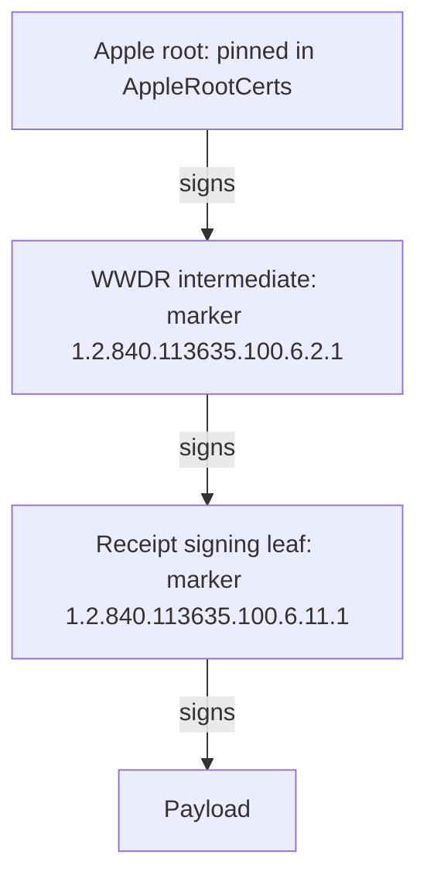

# The Java verifier in 10 minutes

> Read this before the review of `java/`. The full version, with every
> step traced through the code, is [WALKTHROUGH.md](WALKTHROUGH.md)
> (about an hour).

## In 100 seconds

- **One question:** did Apple sign these exact bytes? If yes, you get the
  data back. Bundle id, environment, replay and refunds are your checks.
- **Trust comes only from Apple's roots compiled into the code.** The
  certificates inside a receipt are unsigned and prove nothing on their own.
- **Order:** size and format → chain to a pinned root → Apple's marker OIDs
  → signature → only then read the payload.
- **The chain is judged at the receipt's own signing date,** so an old
  receipt under an expired Apple certificate still verifies.
- **Every failure has a `Reason`.** Bad input → deny. `UNREADABLE_PAYLOAD`
  or `INTERNAL_ERROR` → Apple signed it or we broke: alert.
- **JWS (StoreKit 2):** the same idea, with an ES256 signature and a
  3-certificate `x5c` chain. Deduplicate on `transactionId`.
- **Proof:** 428 shared cases that the Rust core and this Java code must
  answer identically.

## 1. One question

**The library answers one question: did Apple sign these exact bytes?** If
yes, it returns what Apple signed. It runs offline and never calls Apple.

What a verified result does **not** tell you:

| Not checked | Why | Whose job |
|---|---|---|
| Bundle id, environment, product | The library takes no expected values | Your code compares them |
| Replay | A signature proves origin, not that the sender owns the purchase | Grant once per transaction id |
| Freshness | How old is too old depends on the use | Compare `signedDate` or the creation date |
| Revocation, refunds | No OCSP, no CRL: offline is the point | App Store Server API |
| Device binding | Needs a device id the server rarely has | Optional, in your code |

## 2. Signatures and certificate chains

**A signature proves which key signed; a certificate chain proves whose key
it is.**

- **Sign** with a private key, **verify** with the public key. Only the key
  holder can sign; anyone can check.
- A **certificate** says "key K belongs to S, valid from D1 to D2", signed
  by an issuer's key.
- A **chain** runs leaf → intermediate → root. A root signs itself, which
  proves nothing: anyone can self-sign a certificate named "Apple Root CA".
- **Trust comes only from roots pinned in code**: Apple's three roots,
  compiled into `AppleRootCerts`. No JDK trust store, no network.
- **Apple marker OIDs** on the leaf and the intermediate stop an ordinary
  developer certificate, issued under the same WWDR intermediate, from
  signing a receipt.
- **Validity is judged at the payload's own signing date**, not now, so an
  old receipt under an expired Apple certificate still verifies.

**The key insight: a receipt's certificate bag is not signed.** Anyone
relaying a receipt can add, drop or reorder its certificates. No
certificate is trusted for being in the bag; it is trusted only if a pinned
root vouches for it.

## 3. A legacy receipt

**A receipt is base64 of a PKCS#7 (CMS) signed envelope: a signed payload
plus an unsigned bag of certificates.**

| Part | What it holds | Signed? |
|---|---|---|
| ContentInfo, SignedData | The envelope: type OIDs, version, hash algorithms | Framing |
| `eContent` | The payload: a SET of attributes, each `type`, `version`, `value` | **Yes** |
| `certificates` | The bag: typically leaf, WWDR intermediate, a copy of the root | **No** |
| SignerInfo | Which certificate signed (`sid`), hash algorithm, the signature | It is the signature |

Attributes worth knowing: **2** bundle id, **12** creation date (the
instant the chain is judged at), and **17 = one in-app purchase each**,
itself a nested SET: 1702 product id, 1703 transaction id, 1704 purchase
date, 1708 expiry. The genuine sandbox receipts in the repository use RSA
with SHA-1 or SHA-256 and chain to Apple Inc. Root CA.

## 4. The checks, in order

**The chain is always checked before the signature, and the payload is
decoded last.** Each line is check → attack it stops → `Reason` on failure:

1. At most 3,145,728 UTF-8 bytes, canonical base64 → memory exhaustion,
   two decoders disagreeing → `TOO_LARGE`, `MALFORMED`
2. Parse the envelope: nothing trailing, 1 to 4 SignerInfos → garbage,
   amplification → `MALFORMED`
3. Read attribute 12, unverified → nothing: it only picks the instant, and
   falls back to the clock → never fails
4. Decode the bag (at most 10, no key read), then accept certificates
   top-down from the pinned roots → flooding, and an attacker's 16384-bit
   RSA key costing seconds to decode → `MALFORMED` over the cap; strangers
   are just ignored
5. PKIX chain from the signer to a pinned root, valid at the instant, at
   most 6 below the root → forged, foreign or expired chains →
   `UNTRUSTED_CHAIN`, `INVALID_CERTIFICATE`
6. Marker OIDs on leaf and intermediate → a developer certificate signing
   a fake receipt → `INVALID_CERTIFICATE_PURPOSE`
7. CMS signature with the now-trusted key → tampered content →
   `INVALID_SIGNATURE`
8. Decode the payload → nothing: Apple signed it → `UNREADABLE_PAYLOAD`

**Several SignerInfos, or several certificates matching one: the first that
passes decides; if none does, the first failure is the verdict.**

| `Reason` | Meaning | Action |
|---|---|---|
| `MALFORMED`, `TOO_LARGE`, `INVALID_SIGNATURE`, `UNTRUSTED_CHAIN`, `INVALID_CERTIFICATE`, `INVALID_CERTIFICATE_PURPOSE` | The input is bad | Deny |
| `UNREADABLE_PAYLOAD` | Apple signed it, we cannot read it | Alert, do not retry |
| `INTERNAL_ERROR` | The runtime or library broke | Alert, do not retry |

**Unverified input must never produce the last two**, or anyone could page
your on-call engineer.

## 5. JWS (StoreKit 2)

**Same idea, different envelope: a JWS is `header.payload.signature`, three
base64url segments.**

- The header's `alg` must be `ES256` (ECDSA P-256, a 64-byte signature)
  and `x5c` must hold exactly 3 certificates, leaf first.
- The intermediate must be signed by a pinned root (Apple Root CA - G3
  today); `x5c[2]` is decoded but never trusted.
- At most 262,144 bytes, checked first. Then PKIX, the same two marker
  OIDs, then the signature.
- **The instant is `signedDate`, else an app transaction's
  `receiptCreationDate`, else the clock.**
- The payload comes back unchanged; no claim is checked. Deduplicate on
  `transactionId`, never on the JWS string: one JWS has two valid
  signature spellings.

## 6. Five things to check in the code

**These are the properties the whole design rests on.**

1. **No untrusted key is decoded or used.** `getPublicKey()` runs only on
   roots or on certificates whose signature an already-trusted key has
   verified: `ReceiptCore.authenticatedTopDown` (through
   `AppleTrust.signedByAny`) and `JwsCore.authenticateTopDown`.
   Test: `UnauthenticatedKeyCostTest`.
2. **Chain, then markers, then signature.** In `ReceiptCore.verifySigner`:
   `validateChain`, `requireMarkers`, `verifyCmsSignature`; the payload is
   decoded only after, in `parseSignedPayload`. `JwsCore.verifyUnguarded`
   follows the same order.
3. **Failures land on the right `Reason`.** An unchecked exception before
   trust is `MALFORMED` (`VerificationException.unexpected`); after the
   signature, `UNREADABLE_PAYLOAD`. `Failure.message()` never quotes the
   input. Tests: `HostileReceiptInputTest`, `FailureMessageTest`.
4. **One trust door, nothing shared.** Anchors come only from `Config`;
   every crypto call uses the one private `BouncyCastle.PROVIDER`, never
   registered with the JVM; every BouncyCastle object is built per call.
   Tests: `TrustStoreIsolationTest`, `ConcurrencyTest`.
5. **Every check has a shared test case.** `ConformanceCasesTest` runs each
   case in `fixtures/cases.json` as its own test. Never edit a case to make
   the code pass.

Run the suite with `mvn -f java/pom.xml test`.

## 7. Go deeper

**Each topic has a section in the full walkthrough, and each check lives in
one file.**

| To learn | Read |
|---|---|
| Certificates, chains, extensions | [WALKTHROUGH.md §2](WALKTHROUGH.md#2-crash-course-signatures-and-certificates) |
| Why the unsigned bag matters | [WALKTHROUGH.md §4.2](WALKTHROUGH.md#42-the-certificate-bag-is-not-signed) |
| Why each check exists | [WALKTHROUGH.md §5](WALKTHROUGH.md#5-how-a-legacy-receipt-is-verified-conceptually) |
| One real receipt through every method | [WALKTHROUGH.md §6.3](WALKTHROUGH.md#63-the-call-path-traced-on-a-real-receipt) |
| JWS step by step | [WALKTHROUGH.md §7](WALKTHROUGH.md#7-jws-storekit-2-and-the-app-store-server) |
| Limits and the review checklist | [WALKTHROUGH.md §8](WALKTHROUGH.md#8-hostile-inputs-and-limits), [§9](WALKTHROUGH.md#9-how-to-review-this-code) |
| The public API | [README.md](README.md) |

The key files, all in `src/main/java/io/github/emindeniz99/applepurchasereceiptverifier/`:
[`ReceiptCore.java`](src/main/java/io/github/emindeniz99/applepurchasereceiptverifier/ReceiptCore.java)
(the receipt algorithm),
[`JwsCore.java`](src/main/java/io/github/emindeniz99/applepurchasereceiptverifier/JwsCore.java)
(the JWS algorithm),
[`AppleTrust.java`](src/main/java/io/github/emindeniz99/applepurchasereceiptverifier/AppleTrust.java)
(markers, anchors, top-down check),
[`ReceiptCertificates.java`](src/main/java/io/github/emindeniz99/applepurchasereceiptverifier/ReceiptCertificates.java)
(the bag),
[`ReceiptDecoder.java`](src/main/java/io/github/emindeniz99/applepurchasereceiptverifier/ReceiptDecoder.java)
(the payload) and
[`DefaultVerifier.java`](src/main/java/io/github/emindeniz99/applepurchasereceiptverifier/DefaultVerifier.java)
(startup checks, error mapping).
