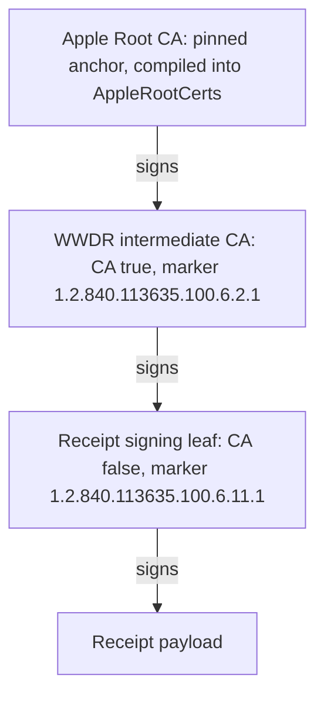
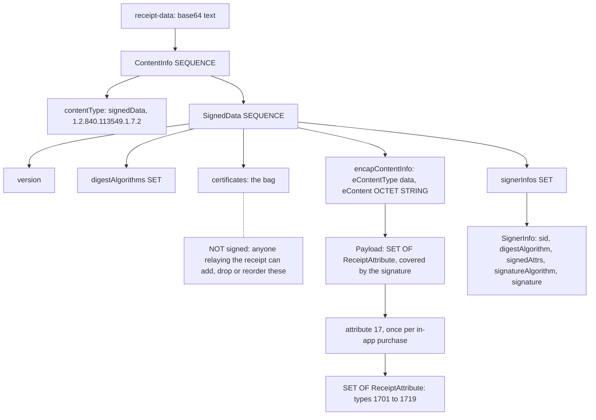
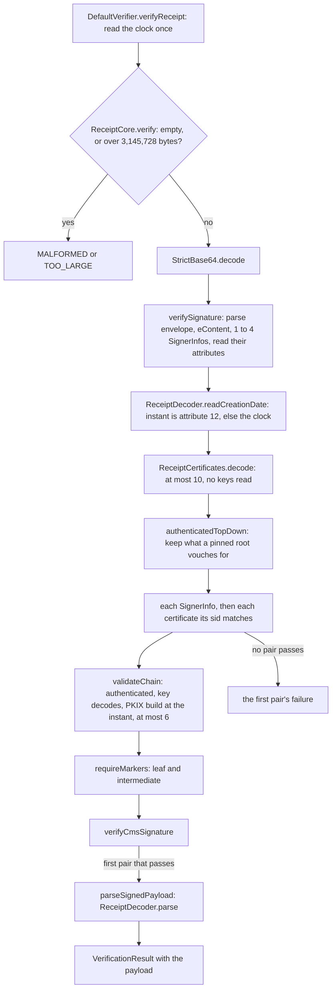

# The Java verifier, walked through

A guide to `java/`, the BouncyCastle implementation of this library, for a
review before production. It assumes you program well and have never worked
with certificates, ASN.1 or Apple receipts.

> **Read this in under an hour.** §1 (3 min) is the problem. §2 and §3
> (15 min) give you the vocabulary. §4 to §6 (22 min) follow a legacy
> receipt from bytes to code, ending with one real receipt traced through
> every method. §7 (5 min) is the JWS path. §8 and §9 (5 min) are limits
> and what to check in review. §10 and the appendix are reference: keep
> them open beside the code.

**Contents**

1. [What problem this solves](#1-what-problem-this-solves)
2. [Crash course: signatures and certificates](#2-crash-course-signatures-and-certificates)
3. [Encodings in five minutes](#3-encodings-in-five-minutes)
4. [Anatomy of a legacy app receipt](#4-anatomy-of-a-legacy-app-receipt)
5. [How a legacy receipt is verified, conceptually](#5-how-a-legacy-receipt-is-verified-conceptually)
6. [Our Java code, step by step (legacy)](#6-our-java-code-step-by-step-legacy)
7. [JWS (StoreKit 2 and the App Store Server)](#7-jws-storekit-2-and-the-app-store-server)
8. [Hostile inputs and limits](#8-hostile-inputs-and-limits)
9. [How to review this code](#9-how-to-review-this-code)
10. [Glossary](#10-glossary)
11. [Appendix: receipt attribute tables](#appendix-receipt-attribute-tables)

**Where the code is.** One Java package,
`io.github.emindeniz99.applepurchasereceiptverifier`, in two directories:

- `java/src/main/java/io/github/emindeniz99/applepurchasereceiptverifier/`:
  the implementation, all package-private (`ReceiptCore`, `JwsCore`, ...).
- `java/src/shared/java/io/github/emindeniz99/applepurchasereceiptverifier/`:
  the public API types (`Config`, `Reason`, `ReceiptPayload`, ...), compiled
  into both Java artifacts.

**Two implementations, one contract.** The repository holds two
independent verifiers. The Rust core (`rust/`, over OpenSSL) is compiled to
`aprv.wasm`, which eight packages run: Node, Go, Python, Ruby, Swift, .NET,
the Java `-wasm` artifact and PHP. This one, `java/`, is a separate
implementation over BouncyCastle. Both must answer every case in
`fixtures/cases.json` the same way, or record why not. This review covers
`java/` only.

**Reading the references.** "Qnn" (Q65, Q71, ...) is a numbered decision
by the repository owner; there is no separate list, so search
docs/rust-core/DECISIONS.md and docs/design/0.7-api.md for the number to
find it with its reasoning. "Rnn" (R20, R44, ...) is a record in
docs/rust-core/DECISIONS.md; R20 lists the known differences between the
Rust core and Java. "PLAN.md Dnn" is an earlier decision in PLAN.md.

## 1. What problem this solves

An app buys something through the App Store. Apple gives the app a signed
record of the purchase, the app sends it to our server, and the server
decides whether to grant the purchase. The client is untrusted: a modified
app or a script can send any bytes. The server must prove, on its own, that
Apple produced the record.

Apple has two formats:

- The **legacy app receipt**: one binary file per installed app, signed with
  PKCS#7, listing the app and its in-app purchases, sent as base64.
  `Verifier.verifyReceipt`.
- The **JWS** of StoreKit 2 and the App Store Server: one small signed JSON
  document per transaction, renewal info, app transaction or server
  notification. `Verifier.verifySignedData`.

"Verify" means exactly one thing: **Apple signed these bytes**, with a
certificate chain ending at an Apple root certificate we pinned in advance.
If so, the library returns what Apple signed. It runs offline and never
calls Apple.

What a verified result does not mean (THREAT-MODEL.md §4; java/README.md,
"What to check after verification"):

| Not checked | Why | Whose job |
|---|---|---|
| Bundle id, environment, product id | The library takes no expected values | The caller compares |
| Replay | A signature proves the record came from Apple, not that the sender is entitled to it | The caller keys grants on transaction ids |
| Freshness | The acceptable age depends on the use: Apple retries a notification for days; a device can present an old genuine receipt | The caller compares `signedDate` or the creation date |
| Revocation, refunds, subscription state | No OCSP, no CRL: offline is the point, and Apple handles a compromised signing certificate by rotating it | App Store Server API, Server Notifications V2 |
| Device binding | Needs a device id the server often lacks | The caller (java/README.md, "The device-hash example") |

## 2. Crash course: signatures and certificates

### 2.1 Hash

A hash function maps any input to a short fixed-size digest, so that
finding two inputs with the same digest is infeasible. SHA-256 gives 32
bytes. SHA-1 (20 bytes) is broken for collisions, but Apple's older
receipts use it, so the library accepts it (§4.4).

### 2.2 Signature

A key pair is a **private key**, kept secret, and a **public key**,
published. Signing runs the private key over a hash of the message;
verifying checks the signature against the message and the public key. Only
the private key's holder can produce a signature that verifies; anyone can
check one. Two families appear here:

- **RSA, PKCS#1 v1.5** (legacy receipts). The signer wraps the hash in a
  structure called **DigestInfo**, which names the hash algorithm, and
  transforms it with the private key; the verifier reverses that with the
  public key and compares. The algorithm fields around the signature are
  not signed, but DigestInfo is. Suppose a relayer edits the SignerInfo to
  say SHA-1 while the signature's DigestInfo says SHA-256: the verifier
  hashes with SHA-1, the recovered DigestInfo still names SHA-256 and its
  hash, they disagree, and the check fails. The label cannot downgrade the
  hash, which is why `ReceiptCore.verifyCmsSignature` does not trust it.
- **ECDSA** (JWS). ES256 is ECDSA on the P-256 curve with SHA-256. A
  signature is two 32-byte numbers, `r` and `s`.

A signature tells you which **key** signed, not who owns the key.
Certificates answer that.

### 2.3 Certificate

An X.509 certificate is a signed statement: "public key K belongs to
subject S, for purposes P, from date D1 to D2", signed by an **issuer**.

| Field | Meaning |
|---|---|
| subject | Whose key this is, as a distinguished name (DN): `CN=Mac App Store and iTunes Store Receipt Signing, OU=Apple Worldwide Developer Relations, O=Apple Inc., C=US` |
| issuer, serialNumber | The DN of the certificate whose key signed this one; issuer plus serial identifies a certificate |
| subjectPublicKeyInfo | The public key |
| validity | `notBefore` and `notAfter` |
| extensions | Further statements (§2.6) |
| signature | The issuer's signature over all of the above, the "to be signed" (TBS) part |

To check a certificate, verify its signature with the **issuer's** public
key. That moves the question up to the issuer's certificate.

### 2.4 Chain and trust anchor

Following issuers gives a **chain**: the **leaf** signs the data, an
**intermediate CA** signs leaves, a **root CA** signs intermediates. A root
is **self-signed**: its signature verifies with its own key. That proves
only that its maker holds the key; anyone can self-sign a certificate named
"Apple Root CA". So trust cannot come from inside a chain. It comes from a
**trust anchor**: a root chosen in advance, by its exact bytes. This library
compiles Apple's three roots into `AppleRootCerts`, `AppleRootCertsTest`
pins them to Apple's published SHA-256 fingerprints and to `certs/`, and
nothing else is consulted: no JDK trust store, no OS store, no network
(`TrustStoreIsolationTest`).

A chain is valid when each signature verifies under the key above it, the
top is signed by an anchor, and every certificate passes the rules below.
The standard algorithm is **PKIX** (RFC 5280): Java's `CertPathBuilder`
finds a path, `CertPathValidator` checks a given one.



**When Apple rotates.** Intermediates are never bundled: they come from the
receipt's certificate bag or the JWS `x5c` header, so a new WWDR
intermediate needs no change here if it chains to a pinned root and carries
the WWDR marker (§2.7). A payload signed under a new **root** fails until
that root is in the anchor set, through a library release or
`Config.builder().roots(...)`. Adding one means its `.cer` in `certs/`, a
constant in `AppleRootCerts` and its fingerprint in `AppleRootCertsTest`
(java/README.md, "Vendoring"; CLAUDE.md lists the Rust-side copies). The
weekly `apple-root-watch` workflow fails when Apple's published roots
change.

### 2.5 Validity, and at which instant

A certificate is valid only between `notBefore` and `notAfter`. Valid at
what instant? Usually "now". But Apple's signing certificates expire and
are replaced, and a receipt signed under an old one stays genuine.
`fixtures/public-receipts/receipt-sandbox-legacy.b64` was created on
2020-05-06; its leaf and intermediate expired on 2023-02-07. Judged now it
fails; judged at its creation date it verifies (case
`receipt/verify-genuine-legacy-sha1-chain`). So validity is judged at the
payload's own signing instant, a receipt's creation date or a JWS's
`signedDate`, and the clock stands in only when there is no usable date.

Why may we trust a date the sender wrote? Because the date only chooses the
moment at which the chain is judged; the chain to a pinned root and the
signature are still required, so a forger gains nothing. §5 has the full
argument.

### 2.6 Extensions

An extension has an OID (§3), a value and a **critical** flag. A validator
that does not recognise a critical extension must reject the certificate;
a non-critical one it may ignore.

| Extension | What it says | Where it matters here |
|---|---|---|
| basicConstraints | `CA: true` lets the key sign certificates | A leaf (`CA: false`) cannot act as an intermediate; PKIX enforces it |
| keyUsage | Bit flags such as keyCertSign | An intermediate without keyCertSign is `UNTRUSTED_CHAIN` (`receipt/reject-intermediate-whose-key-usage-lacks-key-cert-sign`) |
| extendedKeyUsage (EKU) | Purposes as OIDs | BouncyCastle's PKIX handles a critical EKU only on the leaf and would reject one on a CA as unrecognised. `AppleTrust.HANDLED_CRITICAL_EXTENSIONS`, a `PKIXCertPathChecker`, removes it from PKIX's list of unhandled critical extensions ("marks it processed") and asks the CA no purpose (Q69). Any other unrecognised critical extension is still refused |
| subjectKeyIdentifier (SKI), authorityKeyIdentifier (AKI) | Short ids of this certificate's key and of its issuer's key | A CMS SignerInfo may name its signer by SKI (§4.1) |
| cRLDistributionPoints | Where a revocation list lives | No revocation check here; the same checker marks a critical one processed (Q72) |

### 2.7 Apple's marker OIDs

Chaining to an Apple root is not enough. Every Apple developer gets
certificates from the same WWDR (Worldwide Developer Relations)
intermediate under the same root, so without another rule any developer
could sign a fake receipt with their own Apple-issued certificate. Apple
marks its certificates with private extensions stating their purpose, and
the library requires them:

| OID | Required on | Constant |
|---|---|---|
| `1.2.840.113635.100.6.11.1` | The leaf that signs, receipt or JWS | `AppleTrust.SIGNING_LEAF_OID` |
| `1.2.840.113635.100.6.2.1` | The intermediate directly above that leaf | `AppleTrust.INTERMEDIATE_OID` |

`1.2.840.113635` is Apple's OID arc. A missing marker is
`INVALID_CERTIFICATE_PURPOSE`. Apple's published receipt procedure does not
ask for these; here the library is stricter than Apple (RECEIPT-FIELDS.md,
"Chain of trust").

## 3. Encodings in five minutes

**ASN.1** is a schema language, comparable to a protobuf `.proto` file.
Certificates, CMS and the receipt payload are defined in it. Apple's
payload:

```
ReceiptAttribute ::= SEQUENCE { type INTEGER, version INTEGER, value OCTET STRING }
Payload ::= SET OF ReceiptAttribute
```

**DER** (Distinguished Encoding Rules) turns an ASN.1 value into bytes as
**tag, length, value** (TLV). Common tags: `02` INTEGER, `04` OCTET STRING,
`06` OID, `0C` UTF8String, `16` IA5String (7-bit ASCII), `30` SEQUENCE, `31`
SET. A length below 128 is one byte; a longer one is `81`, `82`, ...
followed by that many length bytes (`82 01 2C` is 300). SEQUENCE and SET
are constructed: their value is more TLVs.

**Context tags.** A field inside a SEQUENCE can carry a tag numbered for
that position only, `[0]`, `[1]`, ...: byte `80` plus the number when
primitive, `A0` plus the number when constructed. `[0] IMPLICIT` replaces
the field's own tag; `[0] EXPLICIT` wraps the whole original TLV. SignedData
writes its bag as `certificates [0] IMPLICIT`, and the bag's
non-certificate entries (RFC 5652 CertificateChoices) are tagged `[0]` to
`[3]`.

A receipt attribute of type 2 (bundle id), version 1, value `a.b`:

```
30 0D                SEQUENCE, 13 bytes follow
   02 01 02          INTEGER 2           type: bundle id
   02 01 01          INTEGER 1           version
   04 05             OCTET STRING, 5 bytes:
      0C 03 61 2E 62    UTF8String "a.b"   DER inside the octets
```

The value is an OCTET STRING whose bytes are another DER value. Every
receipt attribute is stored that way.

**BER** is DER's looser parent: it allows several encodings of one value,
such as an indefinite length (`80`, content, `00 00`) or a string split into
chunks. DER allows exactly one. The receipt **envelope** may be BER
(Xcode-signed receipts use indefinite lengths), so one signed receipt can
have several byte spellings: one more reason to deduplicate on transaction
ids, never on receipt bytes.

An **OID** (object identifier) is a dotted number naming a type or an
algorithm: `1.2.840.113549.1.7.2` is CMS signedData, `2.5.29.19` is
basicConstraints.

**Base64** encodes 3 bytes as 4 characters from `A-Z a-z 0-9 + /`, padded
with `=` to a multiple of 4; `receipt-data` and JWS `x5c` entries use it.
**Base64url** replaces `+ /` with `- _` and drops the padding; the three JWS
segments use it. Only the canonical spelling of each is accepted (§8).

**DER versus PEM.** The `.cer` files in `certs/` are raw DER. PEM is the
same DER in base64 between `-----BEGIN CERTIFICATE-----` lines; the
verifier never reads PEM.

## 4. Anatomy of a legacy app receipt

The app reads the receipt file from its bundle and sends it base64-encoded,
typically as `{"receipt-data": "MIIT..."}`. From the outside in:



### 4.1 PKCS#7 and CMS

PKCS#7, later standardised as **CMS** (Cryptographic Message Syntax, RFC
5652), is a generic signed envelope. The outermost value, `ContentInfo`, is
an OID saying what is inside (signedData) plus the content. **SignedData**:

| Field | Holds | In Apple's two genuine receipts (`fixtures/public-receipts/`) |
|---|---|---|
| version | Syntax version | 1 |
| digestAlgorithms | Hash algorithms the signers use, as a hint | SHA-1 (legacy), SHA-256 (g5) |
| encapContentInfo | `eContentType` (data) and `eContent`, the signed payload as an OCTET STRING | The attribute SET |
| certificates | A bag of certificates to help build a chain | Leaf, WWDR intermediate, a copy of Apple Root CA |
| crls | Optional revocation lists | None |
| signerInfos | One entry per signer | One |

A **SignerInfo**:

| Field | Meaning |
|---|---|
| sid | Which certificate signed: issuer DN plus serial number, or an SKI |
| digestAlgorithm | The hash taken over the content |
| signedAttrs | Optional signed attributes (below) |
| signatureAlgorithm, signature | For example rsaEncryption, and the signature bytes |
| unsignedAttrs | Optional; covered by nothing |

What the signature covers depends on signedAttrs. Without them, it is over
the hash of the eContent bytes. With them, it is over the hash of the DER
encoding of signedAttrs, which must in turn carry `messageDigest`, the hash
of the eContent, and a `contentType` equal to `eContentType`, so the content
is still bound through one more step. Apple's two genuine receipts carry no
signedAttrs and name their signer by issuer and serial, so their RSA
signature is directly over the SHA-1 or SHA-256 digest of the payload.

### 4.2 The certificate bag is not signed

This is the most important fact for a reviewer. The signature covers the
content (and signedAttrs), **not** the `certificates` field, so anyone
relaying a receipt can add, remove or reorder bag certificates without
breaking it. Hence:

- No certificate is trusted for being in the bag or for its position.
- Several bag certificates can carry the signer's identity. For example,
  suppose a signing leaf is renewed on the same key, so the old and new
  certificates share one SKI, and a SignerInfo names its signer by that
  SKI. It matches both. If the bag holds the expired copy ahead of the
  valid renewal, trying only the first match would refuse a genuine
  receipt as `INVALID_CERTIFICATE`; the code tries each (case
  `receipt/accept-a-renewed-signer-behind-its-expired-copy`).
- The bag can hold hostile certificates built to burn CPU: decoding a
  16384-bit RSA key costs seconds in BouncyCastle
  ([#161](https://github.com/emindeniz99/apple-purchase-receipt-verifier/issues/161)).

§5 shows how the code answers each.

### 4.3 The payload

The eContent bytes are the DER of `SET OF ReceiptAttribute` (§3). `type`
says what an attribute is, `version` is ignored, and `value` holds the DER
of the real value: a UTF8String, an IA5String date in RFC 3339, an
INTEGER, or raw bytes. Xcode-signed receipts wrap the SET in one more OCTET
STRING, which `ReceiptDecoder.parseAttributeSet` unwraps. A SET has no
order and a type may repeat; attribute 17 repeats once per in-app purchase
and holds a nested SET of in-app attributes. When a modelled type repeats,
the first occurrence wins and the rest go to `unknownAttributes()`.

The attributes that matter most: 2 (bundle id), 12 (creation date, which
sets the chain instant), 17 (in-app purchase), and inside 17: 1702 (product
id), 1703 (transaction id), 1704 (purchase date), 1708 (expiry). The
[appendix](#appendix-receipt-attribute-tables) lists all modelled types
with their getters; skim it.

Decode rules (docs/design/0.7-api.md): missing is `null`, never invented.
Dates are epoch milliseconds UTC, parsed as RFC 3339
(`ReceiptDecoder.parseDate`); an empty date string means "not set". A value
that does not decode is `null`, its octets kept in `unknownAttributes()`,
as are unmodelled types (6 to 11, 13, 14, 1707, 1722, ...). Nothing Apple
signed is dropped.

### 4.4 Apple's chains for receipts

Both genuine receipts in the repository chain to **Apple Inc. Root CA**
(RSA 2048, self-signed with SHA-1, expires 2035-02-09):

| Fixture | Created | Leaf | Intermediate | Algorithms |
|---|---|---|---|---|
| `receipt-sandbox-legacy` | 2020-05-06 | Mac App Store and iTunes Store Receipt Signing | WWDR (G1), expired 2023-02-07 | SHA-1 with RSA throughout: both certificates and the CMS digest |
| `receipt-sandbox-g5` | 2025-12-26 | same subject, expired 2026-08-23 | WWDR G5 | SHA-256 with RSA |

The anchor set holds all three published Apple roots by decision (PLAN.md
D15): Apple Inc. Root CA (legacy receipts today), Apple Root CA - G2 (neither
path today) and Apple Root CA - G3 (ECDSA P-384; JWS today). Any of the
three can anchor either path.

SHA-1 matters operationally: RHEL and Fedora crypto policies disable it in
`jdk.certpath.disabledAlgorithms`, where the JDK's own PKIX would reject
every genuine legacy receipt. Hence the private BouncyCastle provider (§8).

## 5. How a legacy receipt is verified, conceptually

The checks, in the order Java runs them:

| # | Check | What it stops | Fails as |
|---|---|---|---|
| 1 | Non-empty, at most 3,145,728 UTF-8 bytes, before any decoding | Memory and CPU exhaustion | `MALFORMED`, `TOO_LARGE` |
| 2 | Canonical padded base64 | Two decoders reading one string differently; Apple's own rule | `MALFORMED` |
| 3 | Envelope: no trailing bytes, eContent present, 1 to 4 SignerInfos, all their attributes readable | Garbage, smuggled bytes, amplification | `MALFORMED` |
| 4 | Read attribute 12 from the unverified payload to pick the instant | Nothing: this never fails | none |
| 5 | Decode the bag: at most 10 certificates, each decodes, no key read | Certificate flooding | `MALFORMED` |
| 6 | Authenticate the bag top-down from the pinned roots (see "Why top-down" below) | Attacker keys being decoded or used | feeds step 7 |
| 7 | PKIX path from the signer through authenticated bag certificates to a pinned root, valid at the instant, at most 6 certificates below the anchor | Forged and foreign chains, expired certificates, CA rule violations | `UNTRUSTED_CHAIN`, `INVALID_CERTIFICATE` |
| 8 | Marker OIDs on the signer and the intermediate above it | A developer certificate signing a fake receipt | `INVALID_CERTIFICATE_PURPOSE` |
| 9 | CMS signature, with the now-trusted signer key | Tampered content | `INVALID_SIGNATURE` |
| 10 | Decode the payload | Nothing: Apple signed it | `UNREADABLE_PAYLOAD` |

The Rust core counts the bag inside step 3, before the date (THREAT-MODEL.md
§3.3); step 4 never rejects, so both give the same verdict.

**Why reading the creation date before trust is safe.** Step 4 reads bytes
nobody has vouched for and uses them only to choose the instant at which
validity is judged. That cannot make a foreign chain trusted or a bad
signature good: steps 7 to 9 still demand a chain to a pinned root and a
valid signature, so a chosen date only picks a moment when Apple's
certificates were valid, and they sign only what Apple's keys signed.
Apple's own procedure uses this date (RECEIPT-FIELDS.md, step 2c). A
missing, empty or unparseable attribute 12, or any top-level entry that
fails to read, leaves the instant to the clock. The accepted residual risk:
if a historical Apple leaf key ever leaked, a payload back-dated into its
validity would verify, as with Apple's own libraries (THREAT-MODEL.md §4).

**Why top-down
([#161](https://github.com/emindeniz99/apple-purchase-receipt-verifier/issues/161)).**
The naive way decodes every bag certificate's key and lets PKIX search. But
BouncyCastle validates an RSA key while decoding it, which takes seconds
for a 16384-bit modulus the attacker chose. So the code never decodes a key
no pinned root has vouched for. It starts from the roots and accepts a bag
certificate only when an already-trusted key verifies its signature, then
repeats one level down. Only accepted certificates reach PKIX; a stranger
in the bag is never touched (`UnauthenticatedKeyCostTest`). The price: PKIX
verifies those signatures again, about 0.1 ms per receipt.

**Why the chain comes before the signature.** Checking the signature first
would run the attacker's own key, of a size they chose, before anything
about it is trusted. Validity is part of the chain check, so an expired
chain whose signer also lacks a marker answers `INVALID_CERTIFICATE`.

**Several SignerInfos.** Each signs the same content, so one that verifies
is enough. Up to four are tried in order; the first that verifies decides,
and when none does, the first one's failure is the verdict. A SignerInfo
whose algorithm BouncyCastle does not implement counts as not verifying,
and the next is tried, as RFC 4853 asks (Q65). Genuine receipts have one;
the rule keeps a future dual-signed receipt working.

**Several certificates with the signer's identity.** Every certificate a
SignerInfo's `sid` matches is tried in bag order with the same rule (Q69,
Q74); §4.2 has the renewal example this protects.

**What each `Reason` means** (endpoint statuses in §6.4):

| Reason | Meaning |
|---|---|
| `MALFORMED` | Broken structure or a structural bound exceeded, before any signature check, including an unchecked exception BouncyCastle or Jackson threw on unverified input |
| `TOO_LARGE` | Over a size cap, before decoding |
| `INVALID_SIGNATURE` | The signature does not match the content, or BouncyCastle cannot verify the SignerInfo |
| `UNTRUSTED_CHAIN` | No path to a pinned root, or one longer than 6 |
| `INVALID_CERTIFICATE` | A certificate the check needs does not decode, or is outside its validity at the instant |
| `INVALID_CERTIFICATE_PURPOSE` | Chains to a pinned root but lacks a marker OID |
| `UNREADABLE_PAYLOAD` | Apple signed the payload, but it does not parse: a library gap or a new Apple format |
| `INTERNAL_ERROR` | The library or runtime failed: a missing algorithm, a clock that throws |

The first six blame the input: deny. The last two do not: alert, do not
retry (the result is deterministic), and do not deny a paying user on that
basis. So unverified input must never produce the last two, or anyone
could page the on-call engineer at will.

## 6. Our Java code, step by step (legacy)

### 6.1 The public API

```java
Verifier verifier = Verifier.create(Config.defaults());   // once, at startup; share it
VerificationResult<ReceiptPayload> result = verifier.verifyReceipt(base64);
if (result.verified()) {
    ReceiptPayload receipt = result.payload();             // bundleId(), inApp(), environment(), ...
} else {
    Failure failure = result.failure();                   // reason(), message(), cause()
}
```

| Type | Role |
|---|---|
| `Verifier` | `create`, `verifyReceipt`, `verifySignedData`, `verifyReceiptEndpoint`. Never throws for any input (null or empty is `MALFORMED`); only a null `Config` or `Environment` throws. `create` throws at startup on a broken runtime (§8) |
| `Config` | `roots` (default: the three bundled), `clock` (default `Clock.systemUTC()`; used only without a usable payload date, and for `request_date`), `runtimeProbe` (§8) |
| `VerificationResult<T>` | Exactly one of a payload or a `Failure` |
| `Failure` | `reason()`; `message()`, which never quotes input bytes; `cause()`, kept only for `UNREADABLE_PAYLOAD`, `INTERNAL_ERROR` and the `unexpected <class>` form of `MALFORMED` |
| `ReceiptPayload`, `InAppPurchase` | The attributes of §4.3, plus `unknownAttributes()`, `toJson()`, `environment()` |
| `JsonPayload`, `Environment`, `AppleStatus` | A verified JWS payload; `PRODUCTION` or `SANDBOX`; Apple's status codes |

### 6.2 Class map and file order

| Class | Job |
|---|---|
| `DefaultVerifier` | The only `Verifier`: startup checks; reads the clock once per call; maps `VerificationException` to `Failure`, any other `RuntimeException` to `INTERNAL_ERROR` |
| `ReceiptCore` | The legacy algorithm (§6.3) |
| `ReceiptCertificates` | `decode` reads the bag (cap 10) without keys; `signers` lists the certificates a `sid` matches |
| `AppleTrust` | Shared trust material: marker OIDs, anchors, `signedByAny`, `HANDLED_CRITICAL_EXTENSIONS`, `chainFailure` |
| `AppleRootCerts` | The three roots as base64 constants |
| `ReceiptDecoder` | Payload grammar: `readCreationDate`, `parse`, `parseDate`, environment mapping |
| `StrictBase64`, `Utf8Length` | Canonical padded base64 only; UTF-8 byte length without encoding, for the caps |
| `BouncyCastle` | `PROVIDER`, the one `BouncyCastleProvider` instance, never registered with `Security` |
| `VerificationException` | Internal exception carrying a `Reason`; `unexpected`, `toFailure` |
| `JsonFields` | The one streaming JSON object reader (JWS header and payload, endpoint body); a repeated name keeps its last value |
| `JwsCore` | The JWS algorithm (§7) |
| `Endpoint`, `EndpointResponse` | The verifyReceipt emulation (§6.4) |

The two core files are not in call order. Their methods, top to bottom:

| File | Methods in file order |
|---|---|
| `ReceiptCore.java` | (1) `verify`, (2) `verifyDer`, (3) `verifySignature`, (4) `verifySigner`, (5) `parseSignedPayload`, (6) `requireMarkers`, (7) `validateChain`, (8) `authenticatedTopDown`, (9) `verifyCmsSignature`, (10) `signerVerifier` |
| `JwsCore.java` | `verify`, `verifyUnguarded`, class `Header`, `readOrNull`, `readPayload`, classes `Payload` and `Place`, `jwsEnvironment`, `readObject`, `notAnObject`, `decodeBase64Url`, `decodeChain`, `authenticateTopDown`, `decodeKey`, `validateChain`, `verifyEs256` |

Read `verifySignature` and `verifyUnguarded` first: each is the whole
algorithm in a page, and the rest are its steps.

### 6.3 The call path, traced on a real receipt



The table follows the diagram on `fixtures/public-receipts/receipt-sandbox-g5.b64`,
a genuine Apple sandbox receipt (case
`receipt/verify-genuine-sandbox-g5-against-apple-roots`), traced on
2026-10-06 with OpenJDK 21 and BouncyCastle 1.86. The trace's code, commands
and full output are in
[docs/evidence/2026-10-06-walkthrough-trace.md](../docs/evidence/2026-10-06-walkthrough-trace.md).
Numbers in brackets are positions in `ReceiptCore.java` (§6.2).

| Step | Method | What happens on g5 | Reason on failure |
|---|---|---|---|
| 1 | `DefaultVerifier.verifyReceipt` | Reads the clock once, 2026-10-06, before touching the input, so a throwing clock never lands in a catch that blames the input | `INTERNAL_ERROR` |
| 2 | `verify` (1), `Utf8Length.exceeds`, `StrictBase64.decode` | 7,556 characters, under the cap; length divisible by 4, the JDK decoder refuses anything else; 5,665 bytes | `TOO_LARGE`, `MALFORMED` |
| 3 | `verifyDer` (2) | Wraps steps 4 to 9: any `RuntimeException` BouncyCastle throws there becomes `MALFORMED` | `MALFORMED` |
| 4 | `verifySignature` (3), `ReceiptDecoder.readCreationDate` | Nothing after the envelope; eContent of 1,344 bytes; one SignerInfo (issuer WWDR G5 plus serial, SHA-256, rsaEncryption, no signedAttrs), its attributes read up front because BouncyCastle parses them lazily. Attribute 12 is `2025-12-26T18:39:47Z`: the instant | `MALFORMED`; the date never fails |
| 5 | `ReceiptCertificates.decode`, `signers` | Counts the bag before decoding, skips `[0]` to `[3]` entries, reads no key: the leaf (valid to 2026-08-23), WWDR G5 (to 2030-12-10), a copy of Apple Root CA. The `sid` matches one: the leaf | `MALFORMED`: a broken entry, or no match |
| 6 | `authenticatedTopDown` (8), `AppleTrust.signedByAny` | Round 1 accepts WWDR G5 and the root copy, both signed by the pinned Apple Root CA; round 2 the leaf. DNs are compared before any issuer key is decoded | none: a stranger is left out |
| 7 | `verifySigner` (4), `validateChain` (7) | Signer is authenticated; its key decodes; PKIX build at the instant, revocation off: leaf, then WWDR G5, 2 below the anchor. At the clock the same call answers `INVALID_CERTIFICATE`: the leaf expired on 2026-08-23 | `UNTRUSTED_CHAIN`; `INVALID_CERTIFICATE` if outside validity or the key does not decode |
| 8 | `requireMarkers` (6) | The leaf carries `...6.11.1`; `path.get(1)`, WWDR G5, carries `...6.2.1` | `INVALID_CERTIFICATE_PURPOSE`, also for a signer issued directly by a root |
| 9 | `verifyCmsSignature` (9), `signerVerifier` (10) | The verifier is built from the key, not the certificate, so a `signingTime` attribute decides nothing (RFC 5652 §11.3); no algorithm allowlist ([#160](https://github.com/emindeniz99/apple-purchase-receipt-verifier/issues/160)). Valid | `INVALID_SIGNATURE` |
| 10 | `parseSignedPayload` (5), `ReceiptDecoder.parse` | `ProductionSandbox` (environment `SANDBOX`), 2 in-app purchases; types 6, 7, 8, 9, 10, 11, 13, 14, 20, 25 kept raw. An in-app purchase that does not parse would go raw under 17, not fail the receipt | `UNREADABLE_PAYLOAD` |

Steps 7 to 9 run per (SignerInfo, certificate) pair. One constant,
`MAX_PATH_LENGTH` (6), bounds two separate things: the rounds of step 6 and
the length of the path in step 7, which is measured again after PKIX
because PKIX's own limit skips self-issued certificates. Step 7 is §2.5 in
practice: this receipt verifies only because validity is judged at its
creation date.

Failures nobody anticipated:

| Raised inside | Becomes |
|---|---|
| A `RuntimeException` in steps 4 to 6 (before trust) | `MALFORMED` |
| A `RuntimeException` inside `validateChain` | `UNTRUSTED_CHAIN` |
| A missing PKIX or CertStore implementation in `validateChain` | `INTERNAL_ERROR` |
| A `RuntimeException` inside `verifyCmsSignature` | `INVALID_SIGNATURE` |
| A `RuntimeException` inside `parseSignedPayload` | `UNREADABLE_PAYLOAD` |
| Any other `RuntimeException` in `verifyReceipt` | `INTERNAL_ERROR` |

### 6.4 The verifyReceipt-compatible endpoint

`verifyReceiptEndpoint(environment, requestJson)` answers a
`{"receipt-data": "..."}` body as Apple's deprecated verifyReceipt HTTP
endpoint would (`PRODUCTION` or `SANDBOX`), offline. It runs
`ReceiptCore.verify` and maps the outcome in `Endpoint.status`:

| Status | When |
|---|---|
| 0 | Verified, environment matches, every in-app purchase decoded |
| 21002 | `MALFORMED`, `TOO_LARGE`, including a body over 3,145,728 bytes, not a JSON object, or without a string `receipt-data` |
| 21003 | `INVALID_SIGNATURE`, `UNTRUSTED_CHAIN`, `INVALID_CERTIFICATE`, `INVALID_CERTIFICATE_PURPOSE` |
| 21007 | Verified on `PRODUCTION`, but `receipt_type` is not `Production` or `ProductionVPP` (sandbox, Xcode and missing all count) |
| 21008 | Verified on `SANDBOX`, receipt is production |
| 21009 | `UNREADABLE_PAYLOAD`, `INTERNAL_ERROR`, an unexpected exception or a throwing clock; and, checked after 21007 and 21008, a verified receipt with an in-app purchase that did not decode (Q71) |

21009 is deterministic: alert, do not retry. The response body and the
remaining rules are in java/README.md, "The verifyReceipt-compatible
endpoint".

## 7. JWS (StoreKit 2 and the App Store Server)

A **JWS** (JSON Web Signature, RFC 7515) in compact form is three base64url
segments joined by dots: `header.payload.signature`. Decoded:

```json
{"alg":"ES256","x5c":["MIIE...leaf","MIID...intermediate","MIIC...root"]}
```

```json
{"transactionId":"2000000123456789","productId":"com.example.pro","bundleId":"com.example.app","signedDate":1767225600000,"environment":"Sandbox"}
```

(The payload values are illustrative.)

- The **signing input** is the ASCII of the first two segments joined by a
  dot, exactly as received.
- **ES256**: ECDSA P-256 with SHA-256. The signature is 64 bytes, `r` then
  `s`, not DER. Java 8 has no JDK name for that form, so the code uses
  BouncyCastle's `SHA256withPLAIN-ECDSA`.
- **`x5c`**: the chain as standard-base64 DER, leaf first. Apple's is a
  leaf, the WWDR G6 intermediate and Apple Root CA - G3 (a
  `fixtures/cases.json` case is built from it). The markers are the same.
- **The instant**: `signedDate` (epoch milliseconds); if absent or not a
  representable instant, an app transaction's `receiptCreationDate`, as
  Apple's own library does; else the clock. Cases
  `app-transaction/verify-at-the-receipt-creation-date-without-a-signed-date`
  and `app-transaction/signed-date-wins-over-the-receipt-creation-date`.

`JwsCore`, in order:

| # | Step | Fails as |
|---|---|---|
| 1 | Non-empty, at most 262,144 UTF-8 bytes | `MALFORMED`, `TOO_LARGE` |
| 2 | Exactly 3 segments, each canonical base64url (decode, re-encode, compare) | `MALFORMED` |
| 3 | Header is one JSON object, `alg` is `ES256`, `x5c` is exactly 3 strings | `MALFORMED` |
| 4 | `decodeChain`: each entry strict base64 and a certificate; keys not read | `INVALID_CERTIFICATE` |
| 5 | `readOrNull`: read the payload, if it reads, for the instant | never fails |
| 6 | `authenticateTopDown`: intermediate signed by a pinned root, then its key decoded; leaf signed by the intermediate, then its key decoded | `UNTRUSTED_CHAIN`, `INVALID_CERTIFICATE` |
| 7 | `validateChain`: PKIX **validate** of `[leaf, intermediate]` at the instant | `UNTRUSTED_CHAIN`, `INVALID_CERTIFICATE` |
| 8 | Leaf and intermediate markers | `INVALID_CERTIFICATE_PURPOSE` |
| 9 | `verifyEs256`: exactly 64 bytes, then ECDSA with the leaf key | `INVALID_SIGNATURE` |
| 10 | The payload must be one JSON object | `UNREADABLE_PAYLOAD` |

Differences from the receipt path:

- `x5c[2]`, the root, is decoded and never trusted; the pinned anchor stands
  in, and the intermediate must be signed by an anchor directly.
- The order is given, so PKIX validates a fixed path (`CertPathValidator`)
  rather than searching a bag (`CertPathBuilder`).
- The payload comes back unchanged in `JsonPayload.json()`, no claim
  checked. A server notification nests more JWS
  (`data.signedTransactionInfo`, `data.signedRenewalInfo`); pass each to
  `verifySignedData` again.
- The 64-byte check stops a P-384 leaf verifying a 96-byte signature. A
  leaf on another 256-bit curve passes in Java where the Rust core refuses
  it (R20); such a leaf chains to no pinned root anyway.

Two deliberate rules looser than the RFCs (R44):

- **`crit` is ignored.** The header is inside the signing input, so only
  Apple can set `crit` on a JWS that verifies; refusing it could only refuse
  Apple-signed data.
- **High-S signatures are accepted.** If `(r, s)` verifies, so does
  `(r, n - s)`, where `n` is the curve order, so anyone can rewrite the
  third segment without a key and keep header and payload identical. Apple
  documents no low-S rule, so refusing one form could refuse genuine JWS.
  A JWS therefore has two valid spellings: **deduplicate on `transactionId`
  (or `originalTransactionId`) and on a notification's `notificationUUID`,
  never on the JWS string or its hash.**

## 8. Hostile inputs and limits

Fixed bounds (java/README.md, "Resource bounds"):

| Bound | Value | Why | Fails as |
|---|---|---|---|
| Receipt base64; endpoint body | 3,145,728 UTF-8 bytes | Apple's own verifyReceipt limit | `TOO_LARGE` (21002) |
| JWS | 262,144 UTF-8 bytes | Genuine JWS run to about 15 KB | `TOO_LARGE` |
| ASN.1 nesting | BouncyCastle's `max_cons_depth`, 64 by default | The parser recurses; genuine receipts nest 9 deep, which `Verifier.create` checks | `MALFORMED` in the envelope, `UNREADABLE_PAYLOAD` in signed content, `INVALID_CERTIFICATE` in `x5c` |
| Bag certificates | 10 | Genuine receipts embed one to three | `MALFORMED` |
| SignerInfos | 4 | Each costs a chain build and a signature check | `MALFORMED` |
| Chain below the anchor | 6 certificates | Bounds path building | `UNTRUSTED_CHAIN` |
| JSON depth, name, number | 1,000, 50,000, 1,000 (Jackson defaults, in the library's own factories so a host-wide override cannot move them) | Bounded parsing | `MALFORMED`; `UNREADABLE_PAYLOAD` in a signed payload |

Two costs to know (THREAT-MODEL.md §3.7; Q62):

- **Parse before trust.** To find attribute 12, Java decodes the whole
  top-level SET of an unverified payload. A 3 MiB forgery of about 195,000
  tiny attributes costs about 0.2 s, 144 MiB of allocation and 66 MiB of
  extra peak heap. Accepted; the host bounds it with a body cap and a
  concurrency limit.
- **Thread stack.** BouncyCastle's ASN.1 parser recurses. Keep worker stacks
  at 256 KB or more, or a hostile input can end a call with
  `StackOverflowError`, an `Error` outside the never-throws contract.

**Startup checks.** `Verifier.create` (`DefaultVerifier`'s constructor)
throws at deployment instead of failing per call: both Java artifacts on one
classpath (`ClasspathGuard`), a Jackson or BouncyCastle that does not load,
bcprov below 1.86, an ASN.1 nesting bound below 9, or an empty root set.
Then the **runtime probe** (`probeRuntime`; off with
`Config.builder().runtimeProbe(false)`) asks the provider for the SHA-256
digest, the ES256 signature, the X.509 factory, the PKIX validator and
builder and the Collection cert store, and verifies each bundled root's own
signature, so a stripped JRE or a FIPS-mode JDK fails at deployment rather
than on the first receipt.

**Thread safety.** A `Verifier` holds only the anchors and the clock. Every
BouncyCastle object (CMS verifier builder, PKIX builder and validator,
`CertificateFactory`, `Signature`) is built per call; only the provider is
shared. `ConcurrencyTest` runs 16 threads on one instance. On Java 8
`Provider.getService` is synchronized, so calls serialise on it.

**Dependencies and floor.** BouncyCastle `bcprov`, `bcutil`, `bcpkix` 1.86
at one version (1.85 fixed CVE-2026-12860 in the RSA check receipts use),
`jackson-core` 2.16 or later, streaming only. Compiled for Java 8.

**Why one private BouncyCastle provider.** `BouncyCastle.PROVIDER` is never
registered with `Security`, so neither the host's provider order nor
`jdk.certpath.disabledAlgorithms` can change a verdict, and the JVM's
provider list is untouched. The trade-off: an administrator cannot restrict
the library through that policy. BouncyCastle's own `org.bouncycastle.*`
settings still apply; none can make a forged signature verify
(java/README.md lists them).

## 9. How to review this code

1. **No key is used, or even decoded, before a pinned root vouches for its
   certificate.** Every `getPublicKey()` and `verify(` under `java/src/main/`
   must be on a root, on a certificate in the authenticated list, or after
   `authenticateTopDown`. `UnauthenticatedKeyCostTest`.
2. **Order.** Chain, markers, signature; the payload decoded only after the
   signature. Reading attribute 12 or `signedDate` earlier only moves the
   instant and never fails.
3. **Unverified input never yields `UNREADABLE_PAYLOAD` or
   `INTERNAL_ERROR`.** Check every catch against the last table of §6.3.
   `HostileReceiptInputTest`.
4. **No input in messages.** Messages are literals plus counts or dates;
   validator texts stay in the cause, which `toFailure` drops except for the
   reasons in §6.1. `FailureMessageTest`.
5. **One trust door.** Anchors come only from `Config`; nothing builds
   `PKIXParameters` from a `KeyStore` or a default trust manager.
   `TrustStoreIsolationTest`.
6. **No shared mutable state.** Only `PROVIDER`, the anchors and the clock
   outlive a call. `ConcurrencyTest`.
7. **Every check has a shared case.** `fixtures/cases.json` is the contract
   between this code and the Rust core; `ConformanceCasesTest` runs each
   case as its own test, named by its id. A behaviour change touches the
   core, Java and the fixtures in one PR. Never edit a case to make an
   implementation pass.
8. **Divergences are recorded.** Known differences from the Rust core are in
   R20. One that changes the verdict on an Apple-signed input, or accepts
   anything unsigned, is a bug.
9. **Know the accepted risks.** No revocation; a back-dated payload under a
   leaked historical key; the pre-trust parse cost; SHA-1; no
   signer-algorithm allowlist
   ([#160](https://github.com/emindeniz99/apple-purchase-receipt-verifier/issues/160));
   `crit` and high-S (R44). Each has a recorded reason.

Tests are in `java/src/test/java/io/github/emindeniz99/applepurchasereceiptverifier/`
and read `fixtures/` next to `java/`:

```bash
mvn -f java/pom.xml test                              # the whole suite
mvn -f java/pom.xml test -Dtest=ConformanceCasesTest  # only the shared cases
```

Classes named `*Fixture` or `*Fixtures` regenerate fixtures only with
`-Dfixtures.generate=true`. Jazzer fuzzing is in `java/fuzz/README.md`.

## 10. Glossary

| Term | Meaning |
|---|---|
| AKI, SKI | authorityKeyIdentifier and subjectKeyIdentifier: extensions naming the issuer's key and the certificate's own key |
| ASN.1 | Schema language for certificates, CMS and receipts |
| Base64, base64url | Text encodings of bytes; the second uses `- _` and no padding |
| BER, DER | ASN.1 byte encodings: BER allows several per value, DER exactly one |
| CMS | Cryptographic Message Syntax (RFC 5652), the standardised PKCS#7 |
| DigestInfo | What an RSA PKCS#1 v1.5 signature wraps around the hash; names the hash algorithm |
| ECDSA, P-256 | Elliptic-curve signatures on the NIST P-256 curve |
| EKU | extendedKeyUsage: purposes a key may serve |
| ES256 | ECDSA P-256 with SHA-256, in JWS terms |
| High-S | The second valid ECDSA signature `(r, n - s)` for the same message |
| JWS | JSON Web Signature (RFC 7515), `header.payload.signature` |
| Marker OID | Apple's private extensions stating a certificate's purpose (§2.7) |
| OID | Object identifier, a dotted number naming a type or algorithm |
| PKCS#7 | The original name of the CMS signed-envelope format |
| PKIX | The RFC 5280 rules for building and validating certificate paths |
| `sid` | A SignerInfo's pointer to its certificate: issuer and serial, or SKI |
| signedAttrs | Optional CMS attributes the signature covers instead of the content |
| SignerInfo | One signer's entry in CMS SignedData |
| Trust anchor | A root trusted in advance by its exact bytes: `AppleRootCerts` or `Config.roots` |
| verifyReceipt | Apple's deprecated HTTP receipt-validation endpoint, imitated by `verifyReceiptEndpoint` |
| WWDR | Apple Worldwide Developer Relations, the intermediate CA family under Apple's roots |
| x5c | JWS header member carrying the certificate chain, leaf first |
| Xcode receipt | A receipt signed locally by Xcode for testing; it chains to no Apple root and is refused |

## Appendix: receipt attribute tables

Skim these; they are the reference behind §4.3. Constants are in
`ReceiptDecoder`, meanings from RECEIPT-FIELDS.md.

App-level attributes:

| Type | Name | Inner value | `ReceiptPayload` getter | Note |
|---|---|---|---|---|
| 0 | receipt type | UTF8String | `receiptType()` | `Production`, `ProductionSandbox`, `Xcode`, ...; drives `environment()` |
| 1 | app item id | INTEGER | `appItemId()` | 0 in sandbox |
| 2 | bundle id | UTF8String | `bundleId()`, `bundleIdBytes()` | Raw octets kept for the device hash |
| 3 | app version | UTF8String | `applicationVersion()` | Never compared |
| 4 | opaque value | raw bytes | `opaqueValue()` | Device-hash input |
| 5 | SHA-1 hash | 20 raw bytes | `sha1Hash()` | The device hash |
| 12 | receipt creation date | IA5String, RFC 3339 | `receiptCreationDateMs()` | The chain instant |
| 15 | download id | INTEGER | `downloadId()` | Can exceed 2^53, hence `Long` |
| 16 | version external identifier | INTEGER | `versionExternalIdentifier()` | |
| 17 | in-app purchase | SET OF ReceiptAttribute | `inApp()` | One per purchase |
| 18 | original purchase date | IA5String | `originalPurchaseDateMs()` | |
| 19 | original app version | UTF8String | `originalApplicationVersion()` | |
| 21 | receipt expiration date | IA5String | `expirationDateMs()` | Volume Purchase Program only; never compared with a clock |

In-app attributes, inside each 17:

| Type | Name | Inner value | `InAppPurchase` getter |
|---|---|---|---|
| 1701 | quantity | INTEGER | `quantity()` |
| 1702 | product id | UTF8String | `productId()` |
| 1703 | transaction id | UTF8String | `transactionId()` |
| 1704 | purchase date | IA5String | `purchaseDateMs()` |
| 1705 | original transaction id | UTF8String | `originalTransactionId()` |
| 1706 | original purchase date | IA5String | `originalPurchaseDateMs()` |
| 1708 | subscription expiration date | IA5String | `expiresDateMs()` |
| 1711 | web order line item id | INTEGER | `webOrderLineItemId()` |
| 1712 | cancellation date | IA5String | `cancellationDateMs()` |
| 1713 | is trial period | INTEGER flag, 0 is false | `isTrialPeriod()` |
| 1719 | is in intro offer period | INTEGER flag, 0 is false | `isInIntroOfferPeriod()` |
